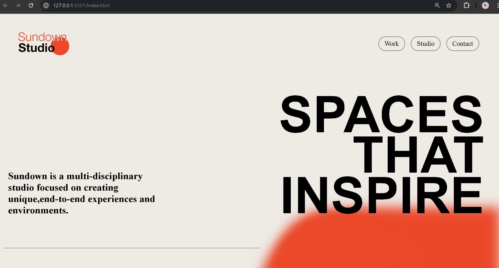

# [Sundown Studio]

)

## Table of Contents

- [Introduction](#introduction)
- [Features](#features)
- [Technologies Used](#technologies-used)
- [Project Structure](#project-structure)

## Introduction

Welcome to Sundown Studio! This project is a responsive frontend web application designed to showcase modern web design techniques and best practices. The aim is to create a visually appealing, user-friendly, and fully responsive website that looks great on any device.

## Features

- **Responsive Design:** Optimized for various devices and screen sizes.
- **Interactive UI:** Smooth animations and transitions.
- **Modern Layout:** Utilizes Flexbox and Grid for a clean and organized layout.

## Technologies Used

- **HTML5**
- **CSS3**
- **JavaScript**
- **GSAP** 

## Project Structure

